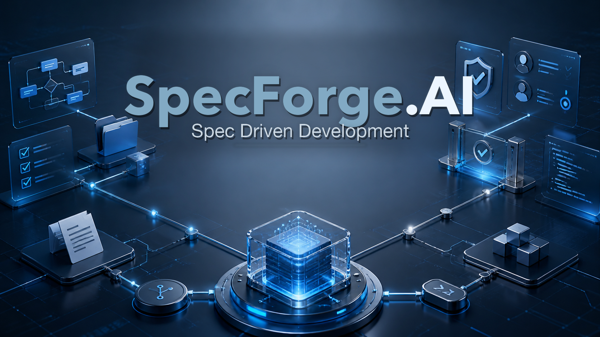
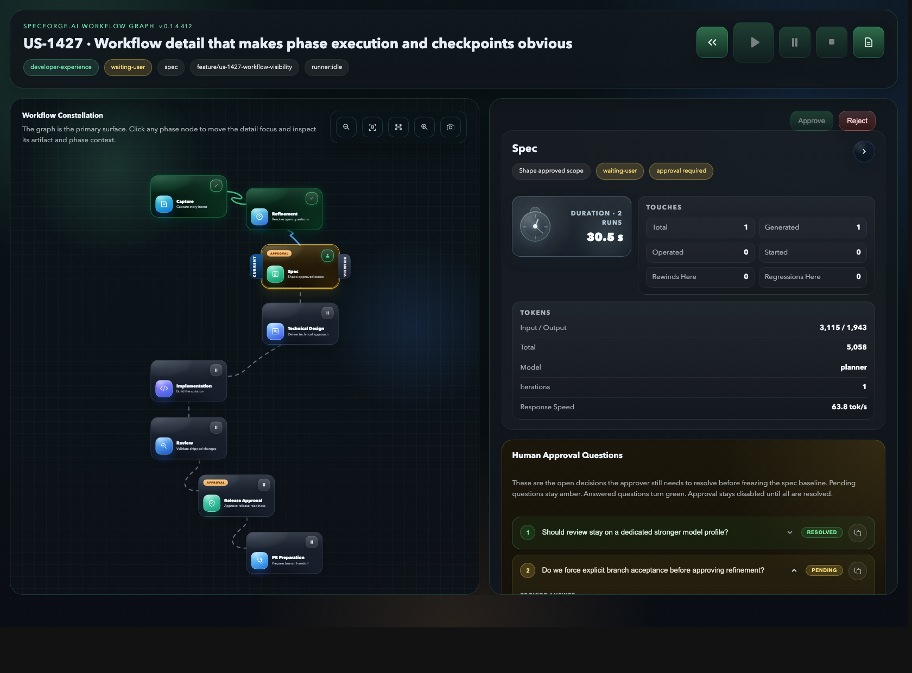
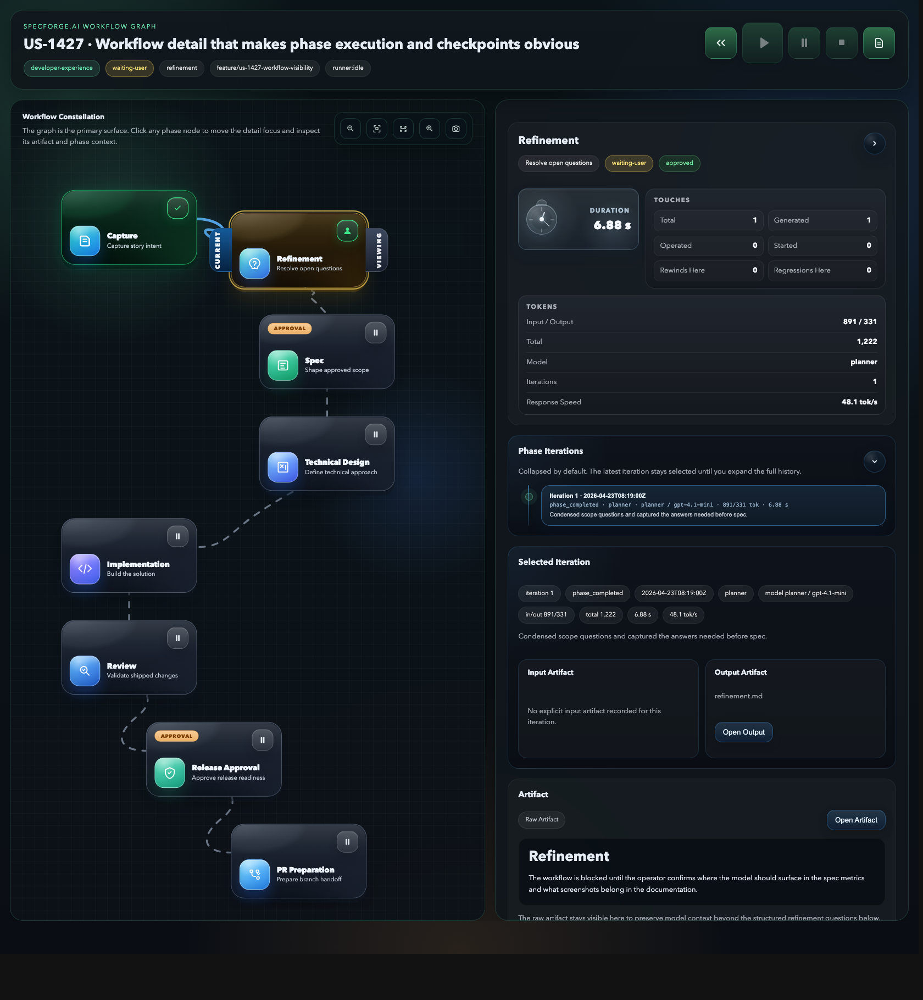
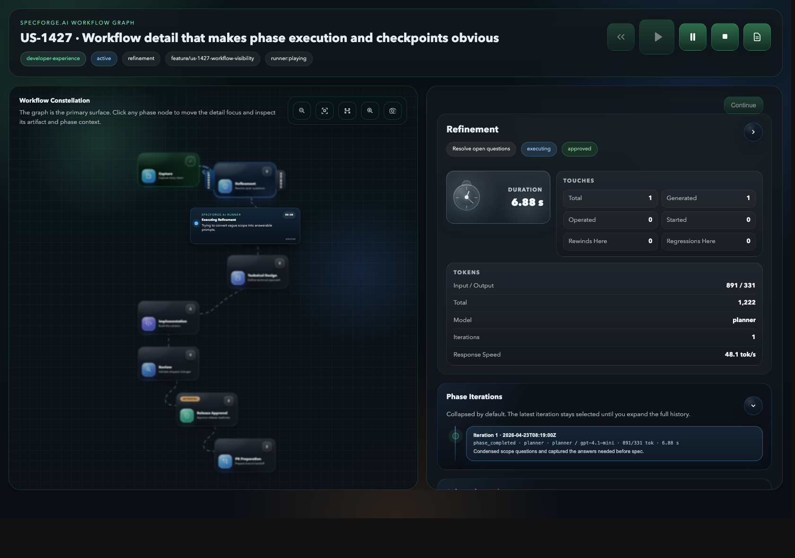

<p align="center">
  <a href="https://github.com/PinedaTec-EU/SpecForge.AI">
    
  </a>
</p>

# SpecForge.AI

SpecForge.AI is an early-stage developer tool for running structured SDD workflows inside VS Code.

The project focuses on governing how AI-assisted development happens, not only on generating code. It introduces explicit phases, persisted artifacts, human checkpoints, regressions, timeline tracking, and a minimal execution core that can evolve into a full MCP-backed workflow system.

## Status

This repository is currently a working foundation, not a finished product.

Implemented today:

- documented phase-1 workflow and persistence model
- .NET domain core for workflow rules and transitions
- local YAML persistence for `state.yaml` and `branch.yaml`
- local timeline and artifact generation via a workflow runner
- minimal VS Code extension scaffold
- user story explorer over `.specs/us/`
- minimal MCP server over `stdio`
- OpenAI-compatible phase provider infrastructure

Not implemented yet:

- full PR integration
- richer prompt inspection UX, diffing, and effective prompt visibility

## Interface Preview

The workflow view is one of the strongest parts of the product already: it makes phase state, checkpoints, runtime metrics, and model routing visible in one place instead of scattering them across logs and prompts.

<p align="center">
  
</p>

The refinement step is also designed as an operational screen, not just a modal interruption. It keeps the blocked questions, repo-context suggestions, and current artifact visible together.

<p align="center">
  
</p>

Playback is intentionally theatrical enough to communicate that the workflow is moving without becoming noisy. The execution overlay pushes the current run state above the graph instead of burying it in the timeline.

<p align="center">
  
</p>

## Features

- Canonical user story workflow:
  - `capture`
  - `spec`
  - `technical-design`
  - `implementation`
  - `review`
  - `release-approval`
  - `pr-preparation`
- Phase execution semantics are explicit:
  - automatic/system-driven phases: `capture`, `technical-design`, `implementation`, `review`, `pr-preparation`
  - human checkpoint phases: `refinement`, `spec`, and `release-approval`
- Explicit approval gates and regression rules
- Local workspace persistence under `.specs/us/<category>/<US-ID>/`
- Human-readable artifacts in Markdown
- Shared audit trail in `timeline.md` with actor and UTC timestamp for user actions
- Explicit artifact operation logs such as `phases/01-spec.ops.md` when a developer asks the model to operate over the current spec
- Technical state in YAML
- Minimal workflow automation through a .NET runner
- Minimal VS Code extension for creating, importing, listing, and opening user stories

## Repository Layout

```text
.
├── doc/                       # Product, architecture, workflow, templates, roadmap
├── media/                     # VS Code extension assets
├── src-vscode/                # VS Code extension source
├── src/SpecForge.Domain/      # Workflow domain and application core
├── tests/SpecForge.Domain.Tests/
├── .specs/                    # Runtime user story persistence in the workspace
├── package.json               # VS Code extension manifest
└── SpecForge.AI.slnx          # .NET solution
```

## Architecture

The current design is intentionally split into layers:

- VS Code extension:
  - user-facing commands and explorer UI
  - workspace interaction
  - artifact opening and local user story discovery
- Domain and application core:
  - workflow rules
  - approval requirements
  - regression validation
  - local artifact and YAML persistence
  - minimal workflow runner
- MCP layer:
  - `stdio` MCP server with `initialize`, `tools/list`, and `tools/call`
  - orchestration boundary between extension and backend execution
  - base for future provider abstraction and richer backend execution
  - workflow file tools for listing, adding, and reclassifying `context files` versus `user story info`

See the detailed design documents in:

- [doc/product-vision.md](doc/product-vision.md)
- [doc/architecture.md](doc/architecture.md)
- [doc/business-rules-convention.md](doc/business-rules-convention.md)
- [doc/workflow-canonico-fase-1.md](doc/workflow-canonico-fase-1.md)
- [doc/spec-schema-fase-1.md](doc/spec-schema-fase-1.md)
- [doc/mcp-contract-fase-1.md](doc/mcp-contract-fase-1.md)
- [doc/implementation-plan.md](doc/implementation-plan.md)

## Installation

### Prerequisites

- .NET SDK 10
- Node.js 23+
- npm 10+
- VS Code 1.100+

### Clone

```bash
git clone <your-fork-or-repo-url>
cd SpecForge.AI
```

### Install Node dependencies

```bash
npm install
```

### Build the VS Code extension sources

```bash
npm run compile
```

The npm scripts invoke the local TypeScript compiler entrypoint directly, so the extension and test builds do not depend on a global `tsc`.

### Run .NET tests

```bash
dotnet test SpecForge.AI.slnx
```

### Run TypeScript tests

```bash
npm run test:ts
```

### Serve the CLI configuration portal

Codex can use the CLI-served configuration portal without depending on the VS Code configuration panel:

```bash
dotnet run --project src/SpecForge.Runner.Cli/SpecForge.Runner.Cli.csproj -- serve-configuration "$PWD"
```

The portal listens on `http://localhost:5127/` by default and persists workspace settings in `.specs/configuration/settings.json`. Workflow CLI commands use that file when model profile environment variables are not provided.

### Serve a CLI workflow portal

The CLI can also serve a workflow status page for a single user story. The page polls persisted workflow and runtime state, so changes performed through MCP tools appear without reopening the page:

```bash
dotnet run --project src/SpecForge.Runner.Cli/SpecForge.Runner.Cli.csproj -- serve-workflow "$PWD" US-001
```

## Model Configuration

By default, phase execution uses a deterministic local engine.

To enable model-backed phase execution, configure at least one model profile and at least one agent profile.

Important: `provider` is not a global setting anymore. It lives inside each item in `specForge.execution.modelProfiles`, next to that profile's endpoint or local-runtime settings. If you omit it, SpecForge.AI defaults it to `openai-compatible`.

`codex` is now a native provider path for phase execution. When a phase resolves to a `codex` profile, SpecForge.AI invokes the local Codex CLI directly instead of the HTTP bridge. The CLI is auto-discovered from `/Applications/Codex.app/Contents/Resources/codex` or `PATH`, and you can override it with `SPECFORGE_CODEX_CLI_PATH`.

`copilot` and `claude` are still routed through the OpenAI-compatible HTTP bridge today.

Minimal shape of one model profile:

```json
{
  "name": "light",
  "provider": "openai-compatible",
  "baseUrl": "http://localhost:11434/v1",
  "apiKey": "",
  "model": "llama3.1",
  "repositoryAccess": "none"
}
```

Equivalent shorthand without an explicit `provider` field:

```json
{
  "name": "light",
  "baseUrl": "http://localhost:11434/v1",
  "apiKey": "",
  "model": "llama3.1",
  "repositoryAccess": "none"
}
```

Model profiles describe engines. Agent profiles describe who runs a phase, which model profile they use, their instructions, and their effective repository permission. Phases route to agents through `specForge.execution.phaseAgents`.

Technical design and review can also run phase-local subagents before the final artifact is synthesized. These flags are off by default:

```json
{
  "specForge.execution.technicalDesignSubagentsEnabled": true,
  "specForge.execution.reviewSubagentsEnabled": true
}
```

When enabled, SpecForge runs specialist model passes using the assigned phase agent, then asks a coordinator pass to produce the single canonical Markdown artifact for the phase. Technical design uses repository, solution-planning, and validation-strategy subagents. Review uses functional, technical, and release-risk auditors.

Minimal agent profile:

```json
{
  "name": "planner",
  "role": "Planning agent",
  "modelProfile": "light",
  "instructions": "Clarify scope, preserve traceability, and avoid code changes.",
  "repositoryAccess": "read"
}
```

Full example with agent routing:

```json
{
  "specForge.execution.modelProfiles": [
    {
      "name": "planner-model",
      "provider": "copilot",
      "baseUrl": "https://api.example.test/v1",
      "apiKey": "<your-api-key>",
      "model": "gpt-4.1-mini"
    },
    {
      "name": "codex-model",
      "provider": "codex"
    },
    {
      "name": "review-model",
      "provider": "claude",
      "baseUrl": "https://api.example.test/v1",
      "apiKey": "<your-api-key>",
      "model": "claude-sonnet"
    }
  ],
  "specForge.execution.agentProfiles": [
    {
      "name": "planner",
      "role": "Planning agent",
      "modelProfile": "planner-model",
      "instructions": "Clarify requirements and keep downstream phases grounded.",
      "repositoryAccess": "read"
    },
    {
      "name": "implementer",
      "role": "Implementation agent",
      "modelProfile": "codex-model",
      "instructions": "Edit the repository and keep changes scoped to the approved design.",
      "repositoryAccess": "read-write"
    },
    {
      "name": "reviewer",
      "role": "Review agent",
      "modelProfile": "review-model",
      "instructions": "Review behavior, tests, and release risk before approval.",
      "repositoryAccess": "read-write"
    }
  ],
  "specForge.execution.phaseAgents": {
    "defaultAgent": "planner",
    "implementationAgent": "implementer",
    "reviewAgent": "reviewer"
  }
}
```

With that setup, capture, refinement, spec, technical design, release approval, and PR preparation use `defaultAgent`; implementation can be routed to the developer's preferred executor; review can use a separate provider family. Agent `repositoryAccess` is enforced:

- `none`: no repository access
- `read`: required for refinement, spec, technical design, release approval, and PR preparation
- `read-write`: required for implementation and review

If no model profiles are configured, SpecForge.AI stays on the deterministic local engine and the UI warns that model-backed execution is incomplete.

For local testing with Ollama, use a single profile that points at the local endpoint:

```json
{
  "specForge.execution.modelProfiles": [
    {
      "name": "local",
      "provider": "openai-compatible",
      "baseUrl": "http://localhost:11434/v1",
      "apiKey": "ollama-local",
      "model": "llama3.1",
      "repositoryAccess": "none"
    }
  ],
  "specForge.execution.agentProfiles": [
    {
      "name": "local-planner",
      "role": "Local planning agent",
      "modelProfile": "local",
      "instructions": "",
      "repositoryAccess": "read"
    }
  ],
  "specForge.execution.phaseAgents": {
    "defaultAgent": "local-planner"
  }
}
```

Example targeted routing for a developer who wants Codex for implementation and Claude for review:

```json
{
  "specForge.execution.modelProfiles": [
    {
      "name": "default-planner",
      "provider": "copilot",
      "baseUrl": "https://api.example.test/v1",
      "apiKey": "<your-api-key>",
      "model": "gpt-4.1-mini",
      "repositoryAccess": "none"
    },
    {
      "name": "codex-main",
      "provider": "codex"
    },
    {
      "name": "claude-review",
      "provider": "claude",
      "baseUrl": "https://api.example.test/v1",
      "apiKey": "<your-api-key>",
      "model": "claude-sonnet"
    }
  ],
  "specForge.execution.agentProfiles": [
    {
      "name": "default-planner",
      "role": "Planner",
      "modelProfile": "default-planner",
      "instructions": "Plan and validate requirements before implementation.",
      "repositoryAccess": "read"
    },
    {
      "name": "codex-implementer",
      "role": "Implementer",
      "modelProfile": "codex-main",
      "instructions": "Implement the approved technical design.",
      "repositoryAccess": "read-write"
    },
    {
      "name": "claude-reviewer",
      "role": "Reviewer",
      "modelProfile": "claude-review",
      "instructions": "Review implementation quality and release risk.",
      "repositoryAccess": "read"
    }
  ],
  "specForge.execution.phaseAgents": {
    "defaultAgent": "default-planner",
    "implementationAgent": "codex-implementer",
    "reviewAgent": "claude-reviewer"
  }
}
```

If you want to point SpecForge.AI at a specific Codex binary instead of the auto-discovered one:

```bash
export SPECFORGE_CODEX_CLI_PATH="/Applications/Codex.app/Contents/Resources/codex"
```

Tolerance can still be controlled through environment variables when launching the backend manually:

```bash
export SPECFORGE_REFINEMENT_TOLERANCE=balanced
export SPECFORGE_REVIEW_TOLERANCE=balanced
export SPECFORGE_REVIEW_EVIDENCE_POLICY=balanced
```

The current supported `provider` values are `openai-compatible`, `codex`, `copilot`, and `claude`.

- `codex` uses the native local Codex CLI.
- `openai-compatible` uses the OpenAI-compatible HTTP chat-completions path.
- `copilot` and `claude` currently use that same HTTP bridge while preserving provider identity in routing and audit metadata.
For refinement, the backend supports three tolerance levels: `strict`, `balanced`, and `inferential`.
This value is sent as `SPECFORGE_REFINEMENT_TOLERANCE`, adds explicit guidance to the refinement prompt, and maps refinement-only `temperature` as follows:

- `strict` -> `0.0`
- `balanced` -> `0.2`
- `inferential` -> `0.4`

For review, the backend supports the same three levels through `SPECFORGE_REVIEW_TOLERANCE`. It adds explicit review guidance to the prompt and maps review-only `temperature` using the same values:

- `strict` -> `0.0`
- `balanced` -> `0.2`
- `inferential` -> `0.4`

Review evidence blocking is controlled separately through `SPECFORGE_REVIEW_EVIDENCE_POLICY`:

- `strict`: every Technical Design validation item blocks review until concrete evidence passes.
- `balanced`: automated and static items block review; operational and deferred items can be recorded as non-blocking evidence gaps.
- `release`: automated and static items block implementation review; operational and deferred items are release-readiness risks.
- `advisory`: validation gaps are reported without forcing review failure by themselves.

Technical Design should prefix each `Validation Strategy` bullet with `[automated]`, `[static]`, `[operational]`, or `[deferred]` so review can apply the configured evidence policy deterministically.

`temperature` is not exposed as an independent extension setting. The supported knobs are `refinementTolerance` and `reviewTolerance`, and the backend derives `temperature` from them for the corresponding phases only.

Prompt templates are embedded in SpecForge.AI and are used by default. Files under `.specs/prompts/` are lazy overrides: the tool writes a prompt file only when you customize that specific template or explicitly export templates. At execution time the extension, MCP backend, and CLI read the disk override first and fall back to the embedded template when no override exists.

## Usage

### Domain core

The .NET core already supports:

- creating a user story root
- persisting `state.yaml` and `branch.yaml`
- validating explicit user-story categories against the repo catalog in `.specs/config.yaml`
- advancing to the next valid phase
- approving approval-required phases
- creating the work branch metadata when the spec phase is approved using `<kind>/us-xxxx-short-slug`
- generating minimal phase artifacts and timeline entries
- serving embedded phase prompts without requiring a repo prompt bootstrap
- exporting prompt overrides under `.specs/prompts/` only when requested
- composing effective phase prompts from disk overrides or embedded templates plus runtime artifacts

### VS Code extension

The extension currently provides:

- a `SpecForge.AI` activity bar view
- a sidebar webview with embedded user-story intake
- an optional guided wizard in that intake to collect the minimum and recommended user-story information before creating the workflow
- a single high-contrast `Create User Story` empty state in the sidebar
- a compact header action in the sidebar to customize a single prompt template or export the full prompt set
- per-user starred user stories persisted on disk inside the workspace
- automatic reopening of the starred user story in workflow view for the same local user
- a default navigation focus on active user stories and active workflows
- a workflow webview opened directly from a user story click
- per-phase detail inside the workflow view with artifact preview
- per-phase prompt access inside the workflow view when the selected phase exposes `execute` or `approve` templates, with disk files created lazily when opened for customization
- user-story file management inside the workflow view, split between `context files` and `user story info`
- only `context files` are injected into model-backed runtime context; `user story info` remains attached to the workflow without entering the model prompt by default
- MCP tools to list, add, and reclassify workflow files so models can attach repo context without going through the VS Code UI
- refinement guidance inside the workflow view inviting the user to add more repo context when the model gets blocked
- local context-file suggestions during refinement using two default-enabled strategies: keyword heuristics and repo-neighborhood discovery
- a feature flag to disable refinement context suggestions without removing manual context-file intake
- persisted runtime status per user story so MCP clients can see whether a long-running phase generation is still active
- duplicate `generate_next_phase` requests are rejected while the same user story already has a live runtime operation
- inline audit stream sourced from `timeline.md`
- play / pause / stop controls for workflow execution
- unified workflow/sidebar state colors documented in `doc/workflow-visual-states.md`
- `Create User Story`
- `Import User Story`
- `Export All Prompt Templates`
- `Customize Prompt Templates`
- `Open Main Artifact`
- `Continue Phase`
- explicit `feature` / `bug` / `hotfix` selection when creating or importing a US
- explicit category selection from the repo category catalog when creating or importing a US
- user-story intake guidance that distinguishes minimum information from recommended extra detail
- extension settings for per-profile model routing, watcher behavior, and attention notifications
- visible configuration warnings with a direct action to open the central execution settings view when model profiles, agent profiles, or phase assignments are incomplete
- a central execution-settings view, launched from the sidebar gear icon, to manage model profiles, agent profiles, and per-phase routing without editing raw VS Code JSON settings
- auto-refresh watcher over `.specs/us/**` when enabled
- lightweight TypeScript tests for explorer grouping, detail rendering, MCP client payload/parsing, and extension command wiring

Current limitation:

- `stop` is best-effort: it cancels the local MCP backend process for the workspace, but it is not yet a durable job-control protocol
- the extension still does not provide a richer prompt editor, diffing, or effective prompt inspection UX
- the sidebar does not yet expose completed user stories through a visibility switch or search; for the MVP it stays focused on active work
- workflow execution controls such as `Play` and `Continue` remain disabled until the configured model and agent profile catalogs are complete

### User-story intake guidance

SpecForge.AI now helps both the user and any MCP-driven model understand what a usable user story should contain.

Minimum information:

- who or what is affected
- what change is requested
- how success will be validated

Recommended detail:

- expected scope or touched areas
- relevant repo context or likely files
- constraints, out-of-scope notes, or extra reviewer context

The sidebar intake keeps the original freeform source box, but also offers an optional guided wizard that turns those answers into structured source text before the user story is created.

### Spec baseline

The `spec` phase is the functional checkpoint of the workflow. Its output is no longer treated as lightweight prose; it is the approved baseline spec for downstream work.

Current expectation for `01-spec.md`:

- inputs
- outputs
- business rules
- edge cases
- errors and failure modes
- constraints
- acceptance criteria
- explicit ambiguities and approval questions

This reduces approval fatigue versus forcing the user to approve both a weak spec and a separate technical design by default. The technical design remains important, but phase 1 now treats it as a derived execution artifact rather than as a mandatory blocking checkpoint in every story.

The exact required schema for that artifact lives in [doc/spec-schema-fase-1.md](doc/spec-schema-fase-1.md). The approval path now validates that schema before the spec baseline can be frozen.

### Workflow readability

The workflow view intentionally distinguishes between:

- automatic phases that the system can execute when model configuration and prompts are ready
- user-driven checkpoints that require explicit approval before the next transition

Today the canonical checkpoints are `spec` as the spec baseline and `release-approval` as the final human release gate. The graph and phase detail make this visible so the operator can see where the workflow will stop and wait for attention.

### Running the extension locally

1. Open the repository in VS Code.
2. Run `npm run compile`.
3. Start the extension from the VS Code Extension Development Host workflow.
4. Use the `SpecForge.AI` activity bar view.

### Extension settings

The extension contributes these settings:

- `specForge.execution.modelProfiles`
- `specForge.execution.agentProfiles`
- `specForge.execution.phaseAgents`
- `specForge.execution.refinementTolerance`
- `specForge.execution.reviewTolerance`
- `specForge.execution.reviewEvidencePolicy`
- `specForge.execution.technicalDesignSubagentsEnabled`
- `specForge.execution.reviewSubagentsEnabled`
- `specForge.execution.autoRefinementAnswersProfile`
- `specForge.ui.enableWatcher`
- `specForge.ui.notifyOnAttention`
- `specForge.features.enableContextSuggestions`
- `specForge.features.requireApprovalBranchAcceptance`
- `specForge.features.autoRefinementAnswersEnabled`
- `specForge.features.autoPlayEnabled`
- `specForge.features.destructiveRewindEnabled`
- `specForge.features.pauseOnFailedReview`

### Execution settings view

The left sidebar now exposes a gear icon that opens a dedicated central execution-settings view.

Use it to:

- create or edit named provider profiles for `codex`, `copilot`, `claude`, or `openai-compatible`
- enter endpoint details for bridge-based providers
- create or edit agent profiles with role, instructions, permissions, and a model profile reference
- assign a configured agent to each workflow phase
- enable switch-style subagent orchestration for technical design and review
- read and write the same persisted values stored under `specForge.execution.modelProfiles`, `specForge.execution.agentProfiles`, and `specForge.execution.phaseAgents`

Example persisted shape:

```json
{
  "specForge.execution.modelProfiles": [
    {
      "name": "codex-main",
      "provider": "codex"
    },
    {
      "name": "compat-review",
      "provider": "openai-compatible",
      "baseUrl": "https://api.example.test/v1",
      "apiKey": "secret",
      "model": "gpt-5.4"
    }
  ],
  "specForge.execution.agentProfiles": [
    {
      "name": "planner",
      "role": "Planner",
      "modelProfile": "compat-review",
      "instructions": "Plan the next workflow step.",
      "repositoryAccess": "read"
    },
    {
      "name": "implementer",
      "role": "Implementer",
      "modelProfile": "codex-main",
      "instructions": "Implement the approved change.",
      "repositoryAccess": "read-write"
    },
    {
      "name": "reviewer",
      "role": "Reviewer",
      "modelProfile": "compat-review",
      "instructions": "Review implementation quality and release risk.",
      "repositoryAccess": "read-write"
    }
  ],
  "specForge.execution.phaseAgents": {
    "defaultAgent": "planner",
    "refinementAgent": "planner",
    "specAgent": "planner",
    "technicalDesignAgent": "planner",
    "implementationAgent": "implementer",
    "reviewAgent": "reviewer"
  },
  "specForge.execution.technicalDesignSubagentsEnabled": true,
  "specForge.execution.reviewSubagentsEnabled": true
}
```

## Persistence Model

Each user story lives under:

```text
.specs/us/<category>/<US-ID>/
```

Typical contents:

```text
.specs/us/workflow/US-0001/
  us.md
  refinement.md
  state.yaml
  runtime.yaml
  branch.yaml
  timeline.md
  context/
  attachments/
  restarts/
  phases/
    00-refinement.md
    01-spec.md
    02-technical-design.md
    03-implementation.md
    04-review.md
```

Per-user VS Code workspace preferences are stored separately:

```text
.specs/users/<local-user>/vscode-preferences.json
```

This preference file currently stores the starred user story that should reopen automatically for that same developer. It is ignored by git by default, so several developers can share the same workspace without overwriting each other's VS Code UX state.

`refinement.md` is persisted separately from `us.md`. The workflow UI keeps the accumulated refinement questions there, while `us.md` remains the stable source artifact instead of being rewritten with each refinement round.

## Roadmap

Last reviewed: 2026-05-09, against implementation through `0.1.4.432`.

### Phase 1 foundation

- [x] define workflow, persistence, and templates
- [x] implement workflow domain rules
- [x] implement local YAML persistence
- [x] implement minimal workflow runner
- [x] create minimal VS Code extension scaffold

### Next

- [x] wire the VS Code extension to the local workflow runner
- [x] introduce a stable application/MCP boundary between UI and backend
- [x] replace placeholder artifact generation with real phase execution
- [x] refresh the explorer and open generated artifacts after workflow actions
- [x] add approval and user-story detail actions to the extension
- [x] add an OpenAI-compatible provider layer usable with OpenAI or Ollama
- [x] embed prompt templates and export disk overrides lazily under `.specs/prompts/`
- [x] execute real model-backed phases without requiring repo prompt initialization
- [x] compose effective per-phase prompts from disk overrides or embedded templates plus runtime context
- [x] expose explicit phase regression through domain, MCP, and VS Code
- [x] implement safe restart from source and archive superseded derived state
- [x] derive branch names from explicit US kind plus short slug
- [x] validate explicit US categories against a repo-configured catalog
- [x] group the VS Code explorer by user-story category
- [x] open user stories into a workflow view with phase detail and timeline audit
- [x] add extension settings for model profiles, agent profiles, phase routing, and watcher behavior
- [x] add watcher-driven refresh, attention notifications, and playback controls with best-effort stop
- [x] keep the default navigation focused on active user stories and workflows for the MVP
- [x] persist a per-user starred user story on disk and autoopen it when reopening the workspace
- [x] suggest refinement-time context files through local heuristics and repo neighborhood, behind a default-enabled feature flag
- [x] expose persisted runtime status so MCP clients can avoid duplicating long-running workflow executions
- [x] add richer phase detail UI and graph visualization
- [x] add CLI workflow portal with graph view, cached rendering, phase selection, and browser-driven workflow actions
- [x] auto-open the workflow portal before model-driven phase iteration when the constellation is not already visible
- [x] harden broad-goal intake and refinement so vague ideas are clarified before buildable user stories are created
- [x] add configurable MVP rigor levels for refinement
- [x] constrain MCP schemas and fail fast on invalid array arguments
- [x] extract MCP/CLI helper units for SRP and broaden edge-case coverage
- [x] package the SpecForge MCP plugin bundle with compiled webview and MCP server artifacts
- [x] support phase agent profiles with real repository permissions
- [ ] finalize richer branch lifecycle rules and Git/PR metadata
- [ ] add issue and PR preparation integration
- [ ] add a switch to show completed user stories and workflows
- [ ] add sidebar search across user stories and workflows
- [ ] add prompt diffing and effective prompt inspection/editing UX
- [ ] add a one-command plugin release pipeline for compile, MCP publish, artifact sync, and validation

## MVP Roadmap

The current target is an MVP, not a feature-complete product.

### MVP scope

- [x] create and import user stories
- [x] persist workflow state and artifacts under `.specs/`
- [x] advance the canonical phase workflow with approvals
- [x] expose the workflow through a local MCP backend
- [x] support embedded prompts with lazy overrides and OpenAI-compatible model profiles
- [x] support explicit regression to an earlier valid phase
- [x] support safe restart from the original source
- [x] support per-user starred user stories with automatic reopening
- [x] support hardened refinement with configurable MVP rigor
- [x] support workflow graph inspection from VS Code and CLI portal
- [x] support MCP/plugin distribution artifacts for local model clients

### Post-MVP

- [x] graph visualization and richer workflow observability
- [ ] prompt diffing and effective prompt inspection UX
- [ ] GitHub PR / issue integration
- [ ] customizable workflows
- [ ] completed user story visibility toggle in the sidebar
- [ ] user story and workflow search in the sidebar

### High-value candidates

- [ ] Definition-of-Ready dashboard for refinement, showing exactly which MVP dimensions still block progress.
- [ ] PR evidence pack generated from workflow timeline, review verdict, validation evidence, and changed files.
- [ ] Review findings workflow with tracked remediation status instead of only Markdown review notes.
- [ ] Roadmap and changelog assistant that drafts updates from `done` commits and waits for human approval.

## Development

Useful commands:

```bash
npm install
npm run compile
dotnet test SpecForge.AI.slnx
```

The repository also contains local VS Code task files and tool manifests. Some of them may still reflect older local conventions and should not be treated as the primary source of truth over the documents in `doc/` and the current codebase.

## Contributing

This repository is still in early design and foundation stages. If you contribute:

- keep the workflow model explicit
- prefer persisted state over implicit conversational state
- avoid adding hidden environment-specific behavior
- update the design docs when you change workflow semantics

## License

[MIT](LICENSE)
