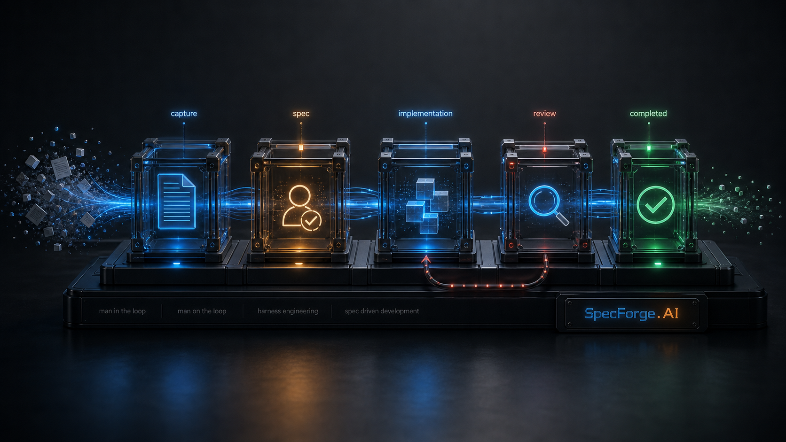

  

# SpecForge.AI

SpecForge.AI is a governed Spec-Driven Development runtime for AI-assisted software teams.

It turns a user story into a traceable delivery workflow with explicit phases, persisted artifacts, audit trail, human checkpoints, regression paths, and an MCP boundary that keeps workflow mutations out of ad hoc chat edits.

## What SpecForge Is

SpecForge is not just a code generator or prompt wrapper.

It is a product for running AI-assisted delivery with repository-local truth:

- specs and workflow artifacts live in the repo under `.specs/`
- phases are explicit and deterministic
- important transitions leave audit evidence
- humans can approve, regress, rewind, or reopen with traceability
- agents operate through MCP tools instead of manually editing workflow state

For this repository itself, that product behavior is not the engineering process. Do not use this repo's `.specs/` tree as the backlog or change-tracking mechanism for developing SpecForge.AI. Self-hosted SpecForge product management, when used, belongs in `specforge-ai-central`.

## Methodological Pillars

A developer reading this repository should understand that SpecForge is built on a small set of explicit engineering pillars, not on ad hoc prompting.

- `Spec-Driven Development (SDD)`: the spec is the contract, phases are explicit, and delivery advances through governed transitions rather than free-form chat continuation.
- `Harness engineering`: the product is the control layer around model execution, including workflow, permissions, routing, evidence, audit, and human checkpoints.
- `Structured critic/rebuilder loop`: the `spec` phase already requires structured criticism and reconstruction before baseline approval. In practice this is the repository's current equivalent of an actor-critic-governor pattern, even when the codebase does not name it `actor-critic-boss`.
- `Human-gated governance`: important risk changes require human approval, and regression, rewind, restart, and reopen are first-class control actions.
- `Repository-local truth`: `.specs/` artifacts, runtime state, and audit history live in the repo and are mutated through MCP operations, not by conversational edits to workflow files.
- `Phase-specialized agents`: model profiles, agent profiles, repository-access levels, and optional subagents let each phase run with a defined operating posture instead of one generic agent mode.

If you want the deeper framing behind these pillars, start with:

- [doc/sdd-seven-layers.md](doc/sdd-seven-layers.md)
- [doc/harness-engineering-checklist.md](doc/harness-engineering-checklist.md)
- [doc/reference/workflow-canonical.md](doc/reference/workflow-canonical.md)
- [doc/model-configuration.md](doc/model-configuration.md)

Today the product ships as:

- a VS Code extension
- a local MCP server over `stdio`
- a self-contained browser workflow portal
- a packaged Codex/MCP plugin bundle for repository-local use

The product boundary between the public local runtime and the private Central side project is documented in [doc/specforge-and-central.md](doc/specforge-and-central.md).

## Why Teams Pick It

SpecForge is strongest when a team wants more than "an agent that writes code from a prompt".

The current differentiators are:

- governed SDD workflow instead of open-ended prompt execution
- repository-local source of truth instead of platform-only state
- explicit human checkpoints and regression semantics
- workflow auditability through artifacts and timeline history
- packaged MCP/plugin distribution for non-VS Code agent clients
- local browser portal for inspection and operation outside the IDE

## What Is Already Strong

The foundation is no longer hypothetical. The current product already includes:

- canonical workflow phases from capture through PR preparation
- .NET workflow/domain core with persisted YAML and Markdown artifacts
- VS Code workflow UX with graph, detail, audit, and contextual actions
- browser workflow portal for local operation outside VS Code
- local MCP server for agent-driven workflow operations
- packaged plugin bundle for repository-local Codex/MCP installation
- model and agent profile routing for phase execution

  

## Market Position

SpecForge competes in the spec-driven development space, but with a narrower claim than most nearby tools.

Compared with tools such as GitHub Spec Kit, Colign, Planu, or Kiro, SpecForge is positioned as a governed, repository-local SDD runtime: explicit workflow, persisted artifacts, auditable transitions, MCP-constrained operations, and a path toward cross-repository governance through SpecForge Central.

SpecForge Central is not planned as an open public SaaS. It is currently a private side project intended as a controlled enterprise offering. If an organization wants to use it, that engagement is commercial. A limited self-hosted model may exist later, but only under controlled product boundaries and governance.

Short version:

- choose lighter alternatives if you mainly want spec templates or a simpler agent workflow
- choose SpecForge if you want governed delivery workflow and repository truth

For the full competitive comparison, see [doc/market-positioning.md](doc/market-positioning.md).

## Roadmap

Near-term priorities:

- richer branch lifecycle and Git/PR metadata
- provider-neutral issue and PR integrations beyond the current GitHub-oriented path
- prompt diffing and effective prompt inspection
- sidebar search and completed-work visibility
- one-command plugin release and validation pipeline

Strategic product direction:

- SpecForge Central as a private enterprise control plane for managed repositories, readiness checks, policy distribution, workflow visibility, drift detection, and audit
- governed shared retrieval, enterprise connectors, and organization-grade tool gateway capabilities through SpecForge Central without weakening the standalone local runtime

The fuller roadmap lives in [doc/roadmap.md](doc/roadmap.md) and the implementation history in [doc/implementation-plan.md](doc/implementation-plan.md).

## Start Here

- evaluating the product: [doc/getting-started.md](doc/getting-started.md)
- consuming the local debug runtime from side projects: [doc/consumer-debug-runtime.md](doc/consumer-debug-runtime.md)
- configuring model and agent routing: [doc/model-configuration.md](doc/model-configuration.md)
- understanding runtime behavior and persistence: [doc/runtime-and-persistence.md](doc/runtime-and-persistence.md)
- contributing to the codebase: [doc/developer-onboarding.md](doc/developer-onboarding.md)

Active backlog tracking lives in GitHub Issues: use `enhancement` for features, `tech-debt` for technical debt, and `bug` for defects. The `doc/` tree is product, architecture, reference, and planning context, not the canonical execution backlog. When a local open-work cache is needed, use the generated unified file [doc/github-backlog.md](doc/github-backlog.md).
Regenerate that view with `npm run backlog:sync`.

## Core Documents

- [doc/product-vision.md](doc/product-vision.md)
- [doc/architecture.md](doc/architecture.md)
- [doc/harness-engineering-checklist.md](doc/harness-engineering-checklist.md)
- [doc/reference/workflow-canonical.md](doc/reference/workflow-canonical.md)
- [doc/reference/mcp-contract.md](doc/reference/mcp-contract.md)
- [doc/reference/spec-schema.md](doc/reference/spec-schema.md)
- [doc/market-positioning.md](doc/market-positioning.md)

## License

[MIT](LICENSE)
