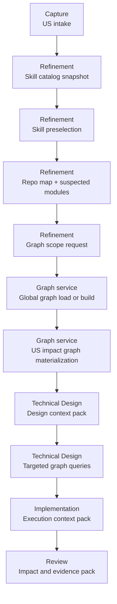

# SpecForge · Skill And Graph Context Orchestration

Last reviewed: 2026-05-19.

## Goal

Define how SpecForge should select and expand runtime context for each workflow phase so the model receives:

- the right repository skills;
- the right codebase evidence;
- the minimum viable context first;
- deeper context only when the phase actually needs it.

This document focuses on two new responsibilities:

- `skill preselection` during `refinement`;
- `graph scope` and graph-backed context expansion during `technical-design`.

It also defines how a repository-global semantic graph and a per-user-story impact graph should coexist.

## Main Rule

Do not inject the full skill catalog or the full code graph into every phase execution.

Instead, the workflow must:

1. start from a compact context baseline;
2. select candidate skills early;
3. identify the probable code scope early;
4. expand graph context progressively;
5. persist the graph artifacts needed for later phases.

## Graph Model

SpecForge should treat graph context as two linked artifacts:

- `global graph`
  - repository-wide semantic graph
  - reusable across user stories
  - built once and refreshed incrementally
- `impact graph`
  - per-user-story scoped subgraph
  - derived from the global graph when available
  - generated from local fallback analysis when the global graph does not exist yet

The global graph is the structural substrate. The impact graph is the phase-oriented working set.

## Pipeline Overview

## Phase Matrix

| Phase | Always include | Optional include | Expand on demand | Persist as output |
| --- | --- | --- | --- | --- |
| `refinement` | `us.md`, active rules, skill catalog, small repo map | similar user stories, recent changed areas | skill details, module hints, graph bootstrap request | `selected_skills`, `suspected_modules`, `graph_scope_request`, `context_gaps` |
| `spec` | approved refinement outputs, active rules | selected skill rationale | examples and prior decisions | approved product contract |
| `technical-design` | approved spec, selected skills, impact graph or fallback mini-graph pack, contracts | similar implementations, risk notes, historic decisions | callers, implementers, neighbors, tests, runtime paths | technical design, follow-up graph queries, impact graph updates |
| `implementation` | approved design, selected skills, target files, impact graph, writable scope | test inventory, related adapters, prior review findings | extra callers, concrete code snippets, edge-case flows | code changes, implementation evidence, impact graph refresh |
| `review` | diff, selected skills, final impact graph, validation evidence | previous failed findings, before/after graph delta | transitive impact, downstream contracts, uncovered paths | review verdict, risks, corrective targets |

## Detailed Blocks

### 1. Skill Catalog Snapshot

Purpose:

- expose the repository-visible skills to the model in compact form;
- avoid forcing the model to discover them blindly from raw files.

Input:

- available shared skills;
- available local skills;
- repository and workflow rules that can affect the phase.

Output:

- a normalized skill catalog with:
  - `id`
  - `name`
  - `scope`
  - `when_to_use`
  - `source_path`
  - `required_by_rule`

Notes:

- the catalog should be short and structured;
- the model should receive summaries first, not full skill bodies.

### 2. Skill Preselection

Phase:

- `refinement`

Purpose:

- let the model infer which skills are probably relevant before technical work begins.

Input:

- user story;
- skill catalog snapshot;
- repository rules;
- small repo map.

Output:

- `selected_skills.required[]`
- `selected_skills.candidate[]`
- `selected_skills.rejected[]`
- `selected_skills.rationale`

Selection rules:

- `required` means a rule or explicit repository convention makes the skill mandatory;
- `candidate` means the story probably needs it but later phases may discard it;
- `rejected` means the skill was considered and excluded to reduce noise.

Why here:

- skill choice is usually easier at refinement time than during implementation panic;
- later phases can reuse the selection instead of re-deriving it every time.

### 3. Repo Map And Suspected Modules

Phase:

- `refinement`

Purpose:

- derive the first technical scope hint without requiring a full semantic graph.

Input:

- user story;
- root directories;
- solution or package manifests;
- workflow-specific known surfaces.

Output:

- `suspected_modules[]`
- `suspected_entrypoints[]`
- `suspected_tests[]`
- `context_gaps[]`

The repo map must stay compact. It is a routing hint, not a full dependency dump.

### 4. Graph Scope Request

Phase:

- `refinement`

Purpose:

- formalize what graph context the next phase will likely need.

Output contract:

- `graph_scope_request.intent`
- `graph_scope_request.seed_nodes[]`
- `graph_scope_request.seed_files[]`
- `graph_scope_request.seed_symbols[]`
- `graph_scope_request.depth`
- `graph_scope_request.include_tests`
- `graph_scope_request.include_runtime_edges`
- `graph_scope_request.open_questions[]`

This output is the handoff from `refinement` to the graph service and then to `technical-design`.

### 5. Global Graph Load Or Build

Owner:

- graph service or graph MCP tool

Purpose:

- provide a repository-wide semantic graph when one already exists;
- build it from zero when it does not;
- refresh only the changed slices when possible.

Rules:

- if the global graph exists and is fresh enough, reuse it;
- if it exists but is stale, refresh incrementally;
- if it does not exist, build a first baseline graph;
- if graph extraction fails, fall back to a mini-graph pack built from direct repository inspection.

Recommended contract for the graph artifact:

- symbols
- files
- modules
- public contracts
- call edges
- import or reference edges
- implementation edges
- test ownership or adjacency
- optional runtime or workflow edges when derivable

Implementation note:

- a semantic graph extractor such as the open-source `code-graph` project can act as the extraction engine;
- SpecForge still needs its own orchestration, persistence, and retrieval contracts around that engine.

### 6. US Impact Graph Materialization

Owner:

- graph service or graph MCP tool

Purpose:

- derive a user-story-specific working subgraph from the global graph or fallback inputs.

Input:

- `graph_scope_request`
- selected skills
- suspected modules
- approved spec when available

Output:

- `impact_graph`
- `impact_summary`
- `graph_confidence`
- `missing_edges_or_unknowns[]`

The impact graph should prefer:

- bounded size;
- explainability;
- traceable seeds;
- usefulness for design and implementation.

### 7. Design Context Pack

Phase:

- `technical-design`

Purpose:

- give the technical design model enough structural context to produce a local-fit design without flooding it.

Minimum contents:

- approved spec;
- selected skills;
- impact summary;
- impact graph;
- relevant contracts and interfaces;
- small set of candidate files;
- known risks or unknowns.

Fallback when no graph exists:

- symbol index for target modules;
- direct dependency tree;
- public contracts;
- nearby tests;
- callers and implementers for seed symbols.

### 8. Targeted Graph Queries

Phase:

- `technical-design`, `implementation`, `review`

Purpose:

- let the phase request more context only when the current pack is insufficient.

Typical query shapes:

- callers of symbol
- implementers of interface
- neighbors within depth `N`
- tests covering module
- downstream contracts touched by file set
- runtime path between two nodes

Rule:

- the workflow should persist the query and the returned summary as execution evidence when it materially shaped the artifact.

### 9. Execution Context Pack

Phase:

- `implementation`

Purpose:

- transform the design-level graph view into a change-ready execution pack.

Minimum contents:

- approved design;
- selected skills;
- final target file set;
- relevant impact graph slice;
- writable scope and repository policy;
- validation targets and tests.

The implementation pack should be narrower than the design pack, not broader.

### 10. Review Impact And Evidence Pack

Phase:

- `review`

Purpose:

- verify the delivered change against both intended and actual structural impact.

Minimum contents:

- diff summary;
- selected skills;
- final impact graph;
- impacted contracts;
- validation evidence;
- expected versus observed impact delta.

## MCP Tooling Direction

This feature likely needs a graph-oriented MCP surface instead of relying only on prompt composition.

Minimum tool family:

- `graph_get_status`
  - check whether a global graph exists and how fresh it is
- `graph_build_global`
  - create the repository-global graph from zero
- `graph_refresh_global`
  - update the existing global graph incrementally
- `graph_build_impact`
  - create or refresh the per-user-story impact graph
- `graph_query`
  - answer bounded graph questions for later phases

Minimum response qualities:

- bounded payloads;
- traceable seeds;
- freshness metadata;
- confidence or fallback metadata;
- summaries before raw expansions.

## Persistence Direction

Recommended persisted artifacts per user story:

- `context/selected-skills.json`
- `context/graph-scope-request.json`
- `context/impact-graph.json`
- `context/impact-summary.md`

Recommended repository-global artifacts:

- `.specs/cache/graphs/global-graph.json`
- `.specs/cache/graphs/global-graph.meta.json`

The exact storage format can change later. The important rule is lifecycle separation:

- global graph for repository reuse;
- impact graph for user-story execution.

## Guardrails

- Do not inject the full global graph into normal phase prompts.
- Do not keep graph context only as free-form markdown.
- Do not make skill selection opaque when it materially influenced the phase.
- Do not require the global graph to exist before the workflow can proceed.
- Do not block `technical-design` if graph extraction fails; use fallback context and record the loss.

## First Implementation Slice

1. Add `skill preselection` outputs to `refinement`.
2. Add `graph scope request` outputs to `refinement`.
3. Define the global-graph and impact-graph persistence contract.
4. Add a first graph MCP tool that can report status and build the global graph from zero.
5. Feed `technical-design` from selected skills plus impact graph or fallback mini-graph pack.

## Open Decisions

- whether the first graph persistence format should be raw extractor output, a normalized SpecForge graph schema, or both;
- how much of the graph query surface should be phase-generic versus repository-language-specific;
- whether graph refresh should run on demand only or also as a background cache warmer;
- whether impact graph generation should happen already in `refinement` or immediately after spec approval.
