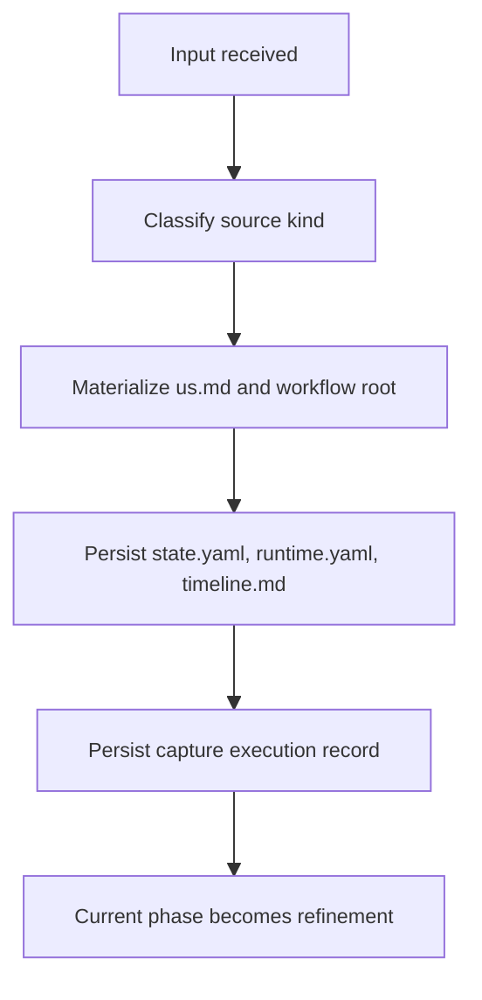
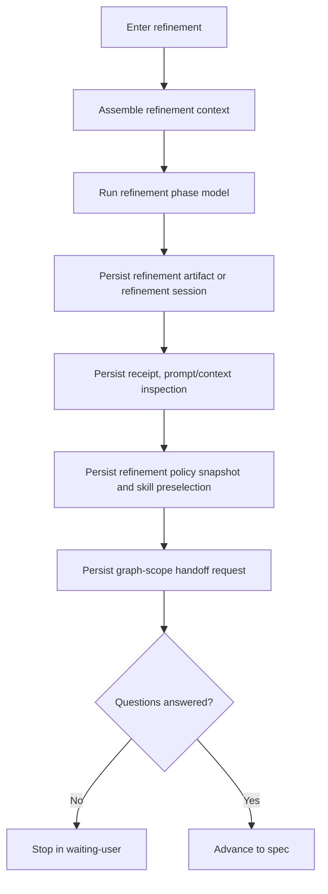
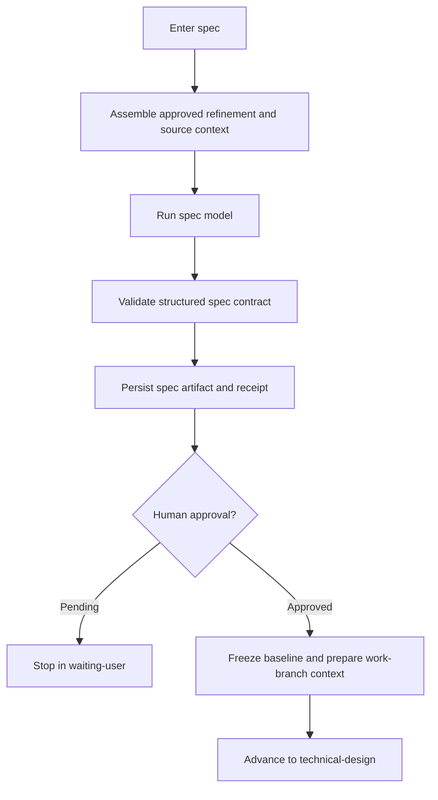
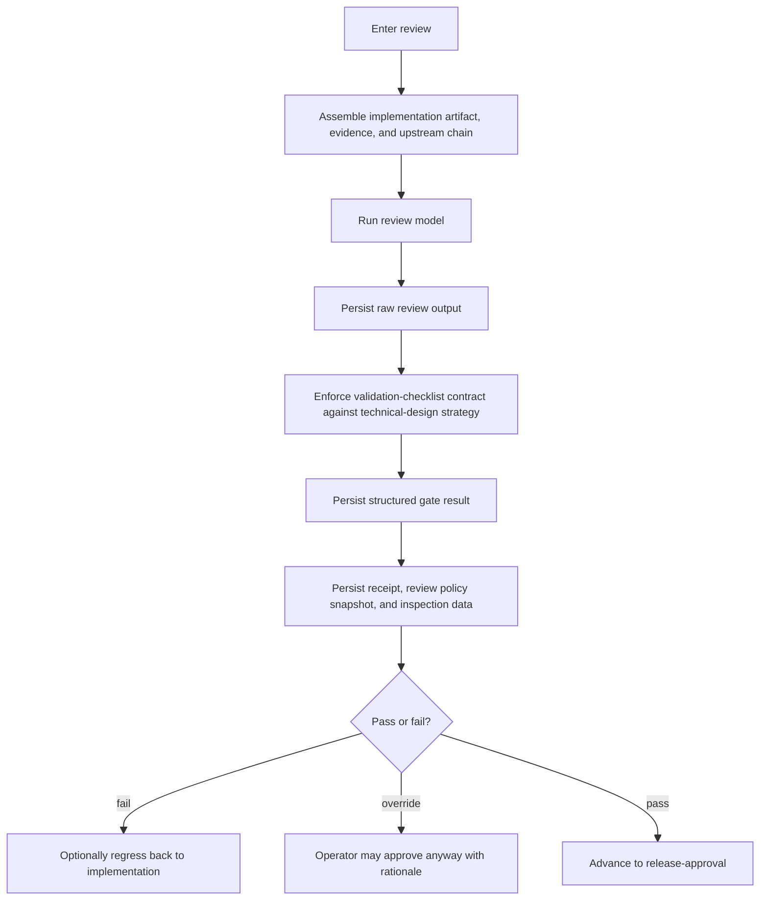
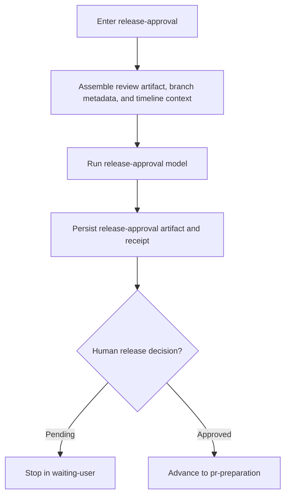
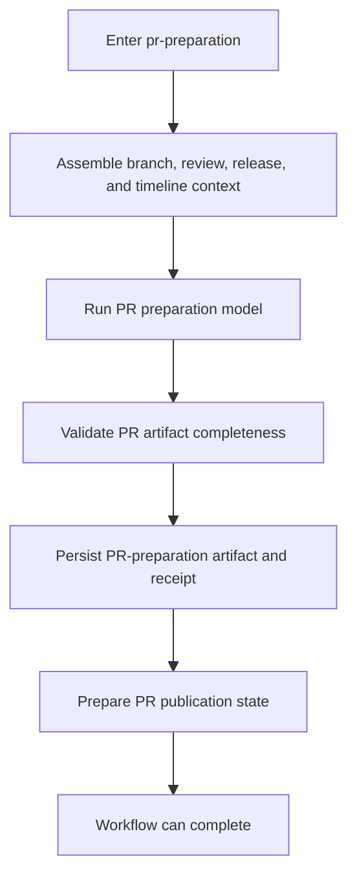

# SpecForge.AI · Phase Runtime Graphs

This document summarizes the relevant runtime steps executed by each workflow phase.

It is intentionally operational, not aspirational:

- it focuses on what the phase materially does in runtime;
- it highlights checkpoints, receipts, and control transfers;
- it helps operators and developers understand the execution path without reverse-engineering the codebase.

## Canonical Phase Chain

```mermaid
%%{init: {'themeVariables': {'fontSize': '12px'}}}%%
flowchart LR
    capture["capture"] --> refinement["refinement"]
    refinement --> spec["spec"]
    spec --> technicalDesign["technical-design"]
    technicalDesign --> implementation["implementation"]
    implementation --> review["review"]
    review --> releaseApproval["release-approval"]
    releaseApproval --> prPreparation["pr-preparation"]
    prPreparation --> completed["completed"]
    review -. regression .-> implementation
```



## 1. Capture



Relevant steps:

- source text or imported markdown is normalized;
- the workflow root and canonical user-story files are created;
- capture metadata is persisted as an observable workflow-entry record;
- no model-backed prompt pipeline runs here.

## 2. Refinement



Relevant steps:

- `us.md`, context files, and refinement session state drive the run;
- unanswered questions can stop the workflow in `waiting-user`;
- refinement persists skill preselection and graph-scope handoff for downstream design;
- receipts capture effective prompt, effective context, and refinement policy state.

## 3. Spec



Relevant steps:

- the runtime enforces spec usability before accepting the artifact;
- approval questions and decomposition blockers are part of the policy surface;
- receipts persist the spec approval policy snapshot;
- approved spec becomes the baseline for all downstream work.

## 4. Technical Design

```mermaid
%%{init: {'themeVariables': {'fontSize': '12px'}}}%%
flowchart TD
    start["Enter technical-design"] --> contextPack["Build technical-design context pack"]
    contextPack --> graph["Expand graph-backed scope and query evidence"]
    graph --> execute["Run technical-design model"]
    execute --> persist["Persist design artifact and receipt"]
    persist --> evidence["Persist design evidence record and context-pack inspection"]
    evidence --> next["Advance to implementation"]
```

Relevant steps:

- technical design consumes skill selection and graph-scope handoff;
- graph-backed expansions and bounded graph-query evidence are injected into the phase;
- the receipt persists the context pack used by the model;
- design remains the bounded handoff into implementation.

## 5. Implementation

```mermaid
%%{init: {'themeVariables': {'fontSize': '12px'}}}%%
flowchart TD
    start["Enter implementation"] --> baseline["Capture workspace baseline snapshot"]
    baseline --> execute["Run implementation model or operation"]
    execute --> evidence["Capture touched files and verification evidence"]
    evidence --> graph["Link graph-scope and impact-graph evidence when present"]
    graph --> persist["Persist implementation artifact, evidence files, and receipt"]
    persist --> policy["Persist implementation policy snapshot and execution envelope"]
    policy --> next["Advance to review"]
```

Relevant steps:

- implementation is the first repository-mutating model-backed phase;
- workspace baseline and post-run snapshots create the evidence substrate;
- touched files and validation evidence are persisted in markdown, JSON, and receipt-linked structured form;
- graph-assisted scope selection is carried into evidence when it influenced the run.

## 6. Review



Relevant steps:

- review consumes implementation evidence as a first-class input;
- the runtime enforces the `Validation Checklist` contract against technical-design validation strategy;
- raw provider output is preserved before enforcement;
- review now exposes structured gate results, live policy visibility, and later snapshot auditability.

## 7. Release Approval



Relevant steps:

- this is the final human release gate;
- branch and timeline metadata are injected as runtime context;
- the release decision depends on the artifact and the accumulated audit trail.

## 8. PR Preparation



Relevant steps:

- PR preparation consumes the full approved workflow chain;
- the PR artifact is validated before being accepted;
- branch publication state is updated from the prepared artifact.

## Cross-Phase Runtime Controls

```mermaid
flowchart TD
    prompts["Prompt catalog and overrides"] --> execution["Phase execution provider"]
    context["PhaseExecutionContext assembly"] --> execution
    execution --> receipt["Execution receipt"]
    execution --> artifact["Phase artifact"]
    receipt --> inspection["Workflow detail / MCP inspection"]
    artifact --> timeline["timeline.md"]
    timeline --> inspection
    graph["Semantic code-graph lifecycle"] --> context
    graph --> implementationEvidence["Implementation evidence"]
    graph --> reviewEvidence["Review linked evidence"]
```

Cross-phase concerns:

- prompt composition and override warnings;
- effective context assembly;
- execution receipts and evidence records;
- timeline audit events;
- policy visibility and snapshots;
- semantic code-graph usage, freshness, and linked evidence.
