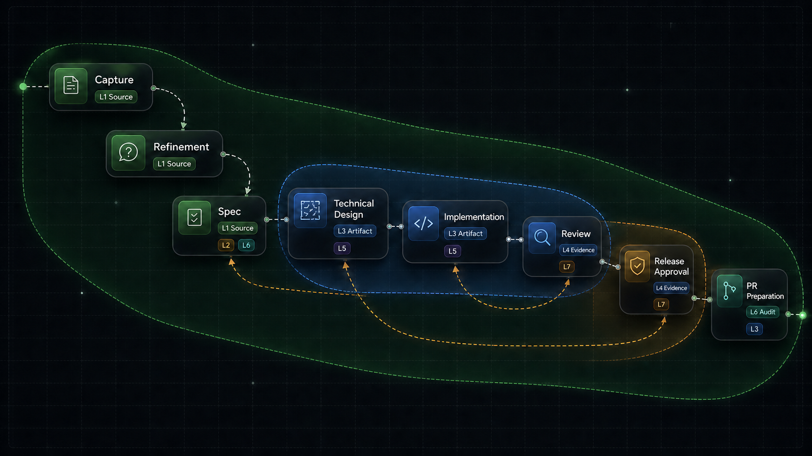

# The 7 layers of SDD


Dante wrote 9 circles for the Inferno. The reference works better here as architecture: a controlled descent, layer by layer, until an idea becomes traceable software.

No eternal punishment.

Just specs, agents, models, people, evidence, and regressions.

Spec-Driven Development needs this framing because the hard part starts after AI generates text: governing what happens after the initial intent.

An idea enters the system.

The system turns it into a contract, workflow, artifacts, evidence, execution, audit, and correction.

These are the 7 layers.

## 🧩 1. Spec as source of truth layer

The first layer sets the authority.

The spec is the contract. Everything derives from it: design, implementation, review, regression, and delivery.

This layer includes the baseline spec, `us.md`, `state.yaml`, branch metadata, and phase-derived specs.

The person still has a strong role: define intent, correct ambiguity, and approve what the system should treat as truth.

The agent acts as a technical scribe. It captures, normalizes, and leaves behind a version that can survive more than one conversation.

The model interprets under contract.

## ⚙️ 2. Deterministic workflow layer

The second layer turns conversation into process.

The workflow defines phases, transitions, preconditions, postconditions, and human approval points.

This layer includes the canonical workflow, transition rules, regression rules, human checkpoints, and the split between automatic phases and approval phases.

An agent cannot move forward because something "seems reasonable".

It moves forward when the state allows it.

A person can approve. An agent can execute. A model can propose. The workflow decides whether the move is valid.

## 🏗️ 3. Artifact generation layer

The third layer forces the system to leave verifiable pieces behind.

Each phase produces persistent artifacts: documents in `phases/*.md`, technical design, implementation artifacts, review artifacts, and release artifacts.

This changes the shape of the work.

The result moves from a polished answer in a chat window to a file that can be opened, reviewed, compared, versioned, and corrected.

The agent leaves material evidence. The model writes under contract. The person reviews something concrete.

## 🔎 4. Evidence and validation layer

The fourth layer cuts subjective review down to size.

An implementation passes because there is evidence.

This layer includes review evidence policies: `strict`, `balanced`, `release`, and `advisory`.

It also includes technical design validation, implementation validation, regression validation, and configurable tolerances.

This layer separates opinion from proof.

The agent gathers evidence. The model reasons over that evidence. The person decides whether the remaining risk is acceptable.

## 🧭 5. Agent governance layer

The fifth layer defines the operational limits of agents.

An agent needs a profile, permissions, phase route, assigned model, repository access, and an effective prompt.

This layer includes agent profiles, model profiles, phase routing, repository access, effective prompt composition, and specialized subagents.

The important idea is simple: the agent gets its authority from the system.

A technical design agent has different limits than a release reviewer. An implementation agent works against the product contract, even when another design would feel easier.

Governance turns agents into operators inside a system with explicit permissions, routes, and responsibilities.

## 🧾 6. Audit and lineage layer

The sixth layer records the story.

Who did what, when, from which state, and with which consequence.

This layer includes `timeline.md`, events with actor and timestamp, archived derived state, safe restart, and the full line from intent to delivery.

This layer matters most when something breaks.

When an implementation changes direction, when an approval is revoked, when a regression reopens an earlier phase, the system needs memory.

Audit exists to reconstruct decisions.

## 🧯 7. Regression and correction layer

The seventh layer accepts that the system must be able to move backward.

Regression is a governance action: archive the previous state, revalidate the spec, and restart from a known point.

This layer includes regression rules, optional destructive rewind, archived previous states, spec revalidation, and safe restart from baseline.

This is the most mature layer of the system because it treats error as an expected operating condition.

Many errors need something more concrete than another prompt: move back to an earlier phase, leave a record, and rebuild the section with better information.

## How phases map to layers



SpecForge currently has 8 operational phases before `completed`. Those phases do not map one-to-one to the 7 SDD layers because some layers are transversal.

The useful mapping is phase to dominant layer, with secondary layers shown where they affect control, governance, audit, or regression.

## The full descent

Seen as architecture, SDD is a chain of control:

1. The spec sets the truth.
2. The workflow decides movement.
3. Artifacts leave reviewable matter behind.
4. Evidence validates.
5. Governance limits agents.
6. Audit preserves the story.
7. Regression corrects without losing lineage.

The Dante reference works because there is a descent.

Here, the descent creates technical control without theatrical drama.

An idea enters at the top as human intent.

It exits at the bottom as versioned, reviewed, auditable delivery.

That is the difference between using AI to generate work and using AI inside an engineering system.

## Header image prompt

```text
Header image, 1920x1080:
16:9 3D conceptual corporate render for a technical article about Spec-Driven Development governance. Minimalist vertical descent through seven transparent technical layers, each layer represented by a distinct control surface: contract document, deterministic workflow gates, generated artifacts, evidence traces, governed agent nodes, audit timeline, and regression checkpoint. People, AI agents, and model nodes appear as small controlled operators inside the system. Steel blue and slate as dominant colors, graphite as secondary depth, subtle restrained amber accents on validation and correction paths, soft data-center studio lighting, translucent digital graphs, flow lines and network nodes, metallic and glass materials, high-end enterprise technology aesthetic, sharp details, no text, no labels, no captions, no logos, no neon colors, avoid mostly black rendering.
```
